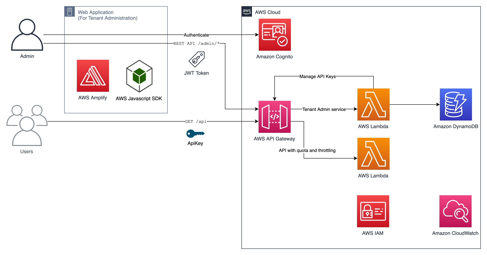

# Shepherd Hub

Workspace for congregation support and visitation planning.

## Included

- Minimal `amplify/` backend
- Email-based Cognito auth resource
- HTTP API backed by a Lambda function
- Basic `ampx` scripts

## Architecture

The application uses a React frontend with Amplify-managed authentication and API routing, backed by a Lambda function and DynamoDB for congregation data.



## DynamoDB Schema

The backend stores congregation members in a DynamoDB table named `test_table`.

- Partition key: `pk`
- Sort key: `sk`
- Data payload: `data`

For congregation members, the key pattern is:

- `pk`: `CONGREGATION`
- `sk`: `MEMBER#<uuid>`

The `data` attribute is a JSON string. It stores the member profile plus visitation history in this shape:

```json
{
  "firstName": "Daniel",
  "lastName": "Wanis",
  "email": "daniel@example.com",
  "phone": "6130000000",
  "role": "Member",
  "status": "Active",
  "address": "121 Hollowbrook Drive",
  "notes": "General member notes",
  "createdAt": "2026-03-28T12:00:00.000Z",
  "updatedAt": "2026-03-28T14:30:00.000Z",
  "history": [
    {
      "timestamp": "2026-03-28T14:30:00.000Z",
      "action": "member_updated",
      "message": "Member details edited."
    }
  ],
  "visitations": [
    {
      "id": "uuid",
      "scheduledAt": "2026-04-04T13:12:00.000Z",
      "note": "Need it as soon as possible",
      "completedAt": "2026-04-04T15:00:00.000Z",
      "updatedAt": "2026-04-04T15:00:00.000Z"
    }
  ]
}
```

Field notes:

- `history` is an array of audit-style entries used by the member details page log.
- `visitations` is an array because one member can have multiple visits.
- Each visit has its own `id`, so schedule updates, notes, and completion status can be applied to a specific visit.

## AWS Setup

1. Install the AWS CLI.

   On macOS with Homebrew:

   ```bash
   brew install awscli
   ```

   Verify the install:

   ```bash
   aws --version
   ```

2. Configure AWS credentials for the target account.

   ```bash
   aws configure
   ```

   Enter:

   - `AWS Access Key ID`
   - `AWS Secret Access Key`
   - `Default region` such as `us-east-1`
   - `Default output format` such as `json`

3. Confirm the CLI is using the expected AWS account.

   ```bash
   aws sts get-caller-identity
   ```

4. Bootstrap the target account and region for CDK asset publishing before running Amplify backend deploys.

   ```bash
   npx cdk bootstrap aws://025890175395/us-east-1
   ```

   Replace `us-east-1` if your Amplify app uses a different region.

## Next Steps

1. Install dependencies:

   ```bash
   npm install
   ```

2. Run the frontend locally:

   ```bash
   npm run dev
   ```

   Open the local URL printed by Vite, usually `http://localhost:5173`.

3. Start the Amplify sandbox backend in a separate terminal:

   ```bash
   npm run ampx:sandbox
   ```

4. Generate Amplify outputs after backend changes so the frontend can discover the API:

   ```bash
   npm run ampx:generate-outputs
   ```

5. Build and preview the production bundle locally if needed:

   ```bash
   npm run build
   npm run preview
   ```

6. Connect the repo in Amplify Hosting when you are ready for CI/CD.

## Notes

- This starter is intentionally minimal.
- The frontend entry point is `src/App.tsx`.
- The Amplify backend includes auth plus a simple Lambda-backed API route for the Congregation page.
- Do not commit AWS access keys or secret credentials to the repository.
