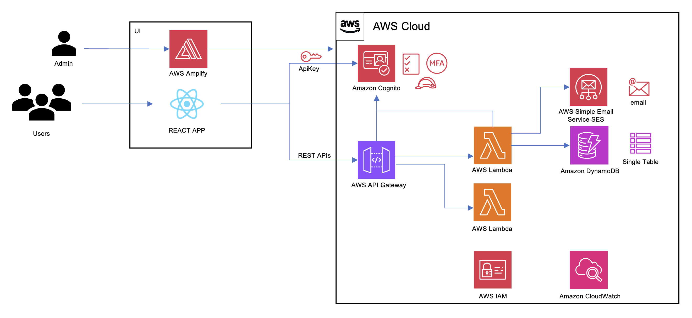

# Shepherd Hub

Workspace for congregation support and visitation planning.

## Included

- Minimal `amplify/` backend
- Email-based Cognito auth resource
- HTTP API backed by a Lambda function
- Basic `ampx` scripts

## Architecture

The application uses a React frontend with Amplify-managed authentication and API routing, backed by a Lambda function and DynamoDB for congregation data.



## DynamoDB Schema

The backend stores congregation members in an Amplify-managed DynamoDB table. The
physical table name is generated per deployment environment rather than hardcoded.

- Partition key: `pk`
- Sort key: `sk`
- Data payload: `data`

For congregation members, the key pattern is:

- `pk`: `CONGREGATION`
- `sk`: `MEMBER#<uuid>`

The `data` attribute is a JSON string. It stores the member profile plus visitation history in this shape:

```json
{
  "firstName": "Daniel",
  "lastName": "Wanis",
  "email": "daniel@example.com",
  "phone": "6130000000",
  "role": "Member",
  "status": "Active",
  "address": "123 Example Street",
  "notes": "General member notes",
  "createdAt": "2026-03-28T12:00:00.000Z",
  "updatedAt": "2026-03-28T14:30:00.000Z",
  "history": [
    {
      "timestamp": "2026-03-28T14:30:00.000Z",
      "action": "member_updated",
      "message": "Member details edited."
    }
  ],
  "visitations": [
    {
      "id": "uuid",
      "scheduledAt": "2026-04-04T13:12:00.000Z",
      "note": "Need it as soon as possible",
      "completedAt": "2026-04-04T15:00:00.000Z",
      "updatedAt": "2026-04-04T15:00:00.000Z"
    }
  ]
}
```

Field notes:

- `history` is an array of audit-style entries used by the member details page log.
- `visitations` is an array because one member can have multiple visits.
- Each visit has its own `id`, so schedule updates, notes, and completion status can be applied to a specific visit.

For weekly announcements, the key pattern is:

- `pk`: `ANNOUNCEMENT`
- `sk`: `WEEK#<uuid>`

The `data` attribute is also a JSON string for announcements. It stores one week of announcement items in this shape:

```json
{
  "weekLabel": "Week of April 7",
  "items": [
    "Board meeting after service",
    "Summer camp registration opens Friday",
    "Parking volunteers needed this weekend"
  ],
  "createdAt": "2026-03-28T12:00:00.000Z",
  "updatedAt": "2026-03-28T14:30:00.000Z"
}
```

Announcement notes:

- each DynamoDB item represents one announcement week
- `weekLabel` is the display label shown in the Announcements page
- `items` is the editable list of announcement strings for that week
- weeks are currently ordered in the UI by descending `sk`

## RBAC

Shepherd Hub uses Amazon Cognito groups for role-based access control.

Configured groups:

- `admin`
- `super_user`
- `regular_user`

Current access model:

- all signed-in users must authenticate with Cognito before the UI is available
- `admin` and `super_user` can access the `User Access` page
- `admin` and `super_user` can assign Cognito users into the supported groups
- the backend also enforces this for the admin user-management API routes, so this is not only a UI restriction

The `User Access` page reads Cognito users from the user pool and allows group assignment for:

- `Admin`
- `Super User`
- `Regular User`

These assignments are stored in Cognito group membership, not in DynamoDB.

## Unit Tests

The Lambda handler has mocked unit tests for all current route handlers.

Files involved:

- test suite: `tests/congregation-message.handler.test.ts`
- test TypeScript config: `tsconfig.lambda-tests.json`
- test script: `npm run test:lambda`

How the tests work:

- the Lambda exports small test helpers that allow the DynamoDB and Cognito clients to be replaced during tests
- the tests use Node's built-in test runner (`node --test`)
- AWS calls are mocked by providing fake `send()` implementations, so no real AWS resources are required
- API Gateway requests are also mocked with in-memory event objects

What is covered:

- congregation list handler
- member create, update, and delete
- visitation schedule, note, and complete actions
- announcements list, create, and delete
- admin user list
- admin group assignment
- RBAC and validation error paths such as missing table config or forbidden access

Run the Lambda unit tests with:

```bash
npm run test:lambda
```

The test script:

1. compiles the backend and test files with `tsconfig.lambda-tests.json`
2. writes the compiled files to `.test-dist/`
3. runs the compiled tests with Node's built-in test runner

These tests are focused on Lambda route logic and mocked AWS interactions. They do not deploy infrastructure and they do not exercise the frontend.

## AWS Setup

1. Install the AWS CLI.

   On macOS with Homebrew:

   ```bash
   brew install awscli
   ```

   Verify the install:

   ```bash
   aws --version
   ```

2. Configure AWS credentials for the target account.

   ```bash
   aws configure
   ```

   Enter:

   - `AWS Access Key ID`
   - `AWS Secret Access Key`
   - `Default region` such as `us-east-1`
   - `Default output format` such as `json`

3. Confirm the CLI is using the expected AWS account.

   ```bash
   aws sts get-caller-identity
   ```

4. Bootstrap the target account and region for CDK asset publishing before running Amplify backend deploys.

   ```bash
   npx cdk bootstrap aws://025890175395/us-east-1
   ```

   Replace `us-east-1` if your Amplify app uses a different region.

## Next Steps

1. Install dependencies:

   ```bash
   npm install
   ```

2. Run the frontend locally:

   ```bash
   npm run dev
   ```

   Open the local URL printed by Vite, usually `http://localhost:5173`.

3. Start the Amplify sandbox backend in a separate terminal:

   ```bash
   npm run ampx:sandbox
   ```

4. Generate Amplify outputs after backend changes so the frontend can discover the API:

   ```bash
   npm run ampx:generate-outputs
   ```

5. Build and preview the production bundle locally if needed:

   ```bash
   npm run build
   npm run preview
   ```

6. Connect the repo in Amplify Hosting when you are ready for CI/CD.

## Android App Setup With Capacitor

This project can be packaged as a native Android app using Capacitor. The web app is built with Vite, and Capacitor copies the production build from `dist/` into the native Android project under `android/`.

### One-time setup

1. Install project dependencies:

   ```bash
   npm install
   ```

2. Install Android Studio.

   Download it from the official Android developer site and install:

   ```text
   https://developer.android.com/studio
   ```

3. In Android Studio, install the required Android SDK components if prompted.

   Open Android Studio and make sure these are available:

   - Android SDK
   - Android SDK Platform for the latest installed API level
   - Android SDK Platform-Tools
   - Android SDK Build-Tools

4. Make sure a Java runtime is available.

   Android Studio usually installs and manages a compatible JDK for Gradle builds. If you build from the terminal and run into Java errors, install a recent JDK and confirm:

   ```bash
   java -version
   ```

### Generate or refresh the Android app

Capacitor is already configured for this repository.

Important files:

- Capacitor config: `capacitor.config.ts`
- Native Android project: `android/`
- Android app id: `com.shepherdhub.app`

Use these commands:

1. Build the React app and sync it into Android:

   ```bash
   npm run cap:sync:android
   ```

   This command:

   - runs the Vite production build
   - copies the web assets into `android/app/src/main/assets/public`
   - updates the Android native project with Capacitor config and plugins

2. Open the Android project in Android Studio:

   ```bash
   npm run cap:open:android
   ```

3. If you only need to copy web changes again after editing the React app, run:

   ```bash
   npm run cap:sync:android
   ```

Whenever you change frontend code in `src/`, rerun `npm run cap:sync:android` before rebuilding or reinstalling the Android app.

### Build the Android app in Android Studio

1. Open the project:

   ```bash
   npm run cap:open:android
   ```

2. Wait for Gradle sync to finish.

3. To run a debug build on a connected device:

   - choose your device from the Android Studio device selector
   - click `Run`

4. To generate an APK manually in Android Studio:

   - open `Build`
   - choose `Build Bundle(s) / APK(s)`
   - choose `Build APK(s)`

5. To generate a release build for distribution later, use:

   - `Build`
   - `Generate Signed Bundle / APK`

   For release distribution, Android requires signing credentials. Keep the keystore file and passwords in a safe place.

### Build the Android app from the command line

After syncing Capacitor, you can also build from the terminal:

1. Build a debug APK:

   ```bash
   cd android
   ./gradlew assembleDebug
   ```

2. The generated debug APK is typically located at:

   ```text
   android/app/build/outputs/apk/debug/app-debug.apk
   ```

3. Build a release APK:

   ```bash
   cd android
   ./gradlew assembleRelease
   ```

4. The generated release APK is typically located at:

   ```text
   android/app/build/outputs/apk/release/app-release.apk
   ```

The current Android project uses:

- minimum Android SDK: `24`
- target Android SDK: `36`

These values come from `android/variables.gradle`.

### Install the app on your Android phone with Android Studio

1. On your phone, enable Developer Options.

   On most Android devices:

   - open `Settings`
   - open `About phone`
   - tap `Build number` several times until developer mode is enabled

2. Enable `USB debugging` in `Developer options`.

3. Connect the phone to your computer with a USB cable.

4. Approve the `Allow USB debugging` prompt on the phone if it appears.

5. Open the Android project in Android Studio:

   ```bash
   npm run cap:open:android
   ```

6. Select your phone as the target device and click `Run`.

Android Studio will build, install, and launch the app for you.

### Install the app on your Android phone with ADB

If you prefer the command line, use Android Debug Bridge (`adb`).

1. Make sure USB debugging is enabled on the phone.

2. Connect the phone over USB.

3. Confirm that your device is visible:

   ```bash
   adb devices
   ```

   If the device shows as unauthorized, unlock the phone and approve the debugging prompt.

4. Build the debug APK:

   ```bash
   cd android
   ./gradlew assembleDebug
   ```

5. Install it on the phone:

   ```bash
   adb install -r app/build/outputs/apk/debug/app-debug.apk
   ```

The `-r` flag reinstalls the app while keeping the same application id.

### Install the app by copying the APK to your phone

You can also copy the built APK to the phone and install it manually.

1. Build the debug APK:

   ```bash
   cd android
   ./gradlew assembleDebug
   ```

2. Copy this file to your phone:

   ```text
   android/app/build/outputs/apk/debug/app-debug.apk
   ```

3. Open the APK on the phone and allow installation if Android prompts for permission to install unknown apps.

This method is useful when USB debugging is not available, but direct install through Android Studio or `adb` is usually easier during development.

### Typical development workflow

After the initial setup, the normal loop is:

1. Make changes to the React app.
2. Sync the latest web build into Android:

   ```bash
   npm run cap:sync:android
   ```

3. Rebuild and run from Android Studio, or rebuild from the terminal:

   ```bash
   cd android
   ./gradlew assembleDebug
   ```

4. Install to the phone again if needed:

   ```bash
   adb install -r app/build/outputs/apk/debug/app-debug.apk
   ```

### Troubleshooting

- If Android Studio shows Gradle or SDK errors, open the project in Android Studio and let it install any missing SDK packages.
- If terminal builds fail because `adb` is not found, add Android SDK Platform-Tools to your shell `PATH`.
- If the app opens with old web content, rerun `npm run cap:sync:android` and rebuild the native app.
- If the phone is not detected, try a different USB cable, switch the USB mode to file transfer, and run `adb devices` again.
- If you change Capacitor config or add Capacitor plugins later, rerun `npm run cap:sync:android`.

## Notes

- This starter is intentionally minimal.
- The frontend entry point is `src/App.tsx`.
- The Amplify backend includes auth plus a simple Lambda-backed API route for the Congregation page.
- Do not commit AWS access keys or secret credentials to the repository.
